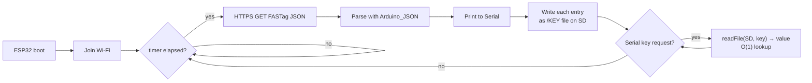

# StackFusion-ESP--


**ESP32 firmware for parking-RFID account lookup — fetches FASTag JSON data over Wi-Fi and indexes it on an SD card for O(1) key lookups.**

This is an embedded prototype built for the StackFusion / Parkzap parking-RFID workflow. An ESP32
connects to a Wi-Fi network, polls a JSON endpoint that returns FASTag account records, parses the
response with `Arduino_JSON`, and — per the design below — mirrors each record onto an SD card as a
flat key→value file system so any later lookup by vehicle tag is a constant-time file open instead
of a linear scan.

> [!NOTE]
> The committed sketch (`stackfusion_esp32.ino`) currently implements the **network + parse** half:
> Wi-Fi join, HTTPS GET, and JSON parse over Serial. The **SD-card indexing** half is documented in
> [How it works](#-how-it-works) and is the next commit.

---

## ✨ Features

- **Wi-Fi client** — joins a configured SSID and reconnects transparently on disconnect.
- **Polled HTTPS GET** — hits `https://fastag-internal.parkzap.com/account/mockable_test/` on a
  configurable timer (default 10 s) and prints the raw payload + HTTP status to Serial.
- **JSON parse** — `Arduino_JSON` turns the response into a navigable object so individual fields
  can be pulled out by key.
- **SD-card key-value store** *(design)* — each JSON entry is written as a file named after its key,
  turning lookups into an O(1) file read instead of an O(N) array scan.
- **Minimal footprint** — pure Arduino core, no external RTOS or framework; runs on any ESP32
  dev board with no extra runtime.

## 📦 Installation

### Prerequisites

- An **ESP32 dev board** (e.g. ESP32-DevKitC, NodeMCU-32S, any ESP32-WROOM variant).
- **Arduino IDE 1.8.19+** (or Arduino CLI / PlatformIO) with the
  [Arduino-ESP32 core](https://github.com/espressif/arduino-esp32) installed via *Boards Manager*.
- Board selected in the IDE: **Tools → Board → ESP32 Arduino → "ESP32 Dev Module"** (or your variant).
- **microSD card module** (SPI) wired to the ESP32's VSPI/HSPI pins — required once the
  SD-card indexing half is wired in.
- The following libraries (all available from *Sketch → Include Library → Manage Libraries…*):

| Library | Source | Purpose |
|---|---|---|
| `WiFi` | Arduino-ESP32 core (built-in) | Station-mode Wi-Fi |
| `HTTPClient` | Arduino-ESP32 core (built-in) | HTTPS GET requests |
| `Arduino_JSON` | Library Manager (`Arduino_JSON` by Arduino) | Parse the FASTag response |
| `SD` | Arduino-ESP32 core (built-in) | microSD card read/write *(used by the indexing half)* |

### Get the source

```bash
git clone https://github.com/bhoot1234567890/StackFusion-ESP--.git
cd StackFusion-ESP--
```

Open `stackfusion_esp32.ino` in the Arduino IDE.

## 🚀 Usage

1. **Set your Wi-Fi credentials** at the top of `stackfusion_esp32.ino`:

   ```cpp
   const char* ssid     = "YOUR_SSID";
   const char* password = "YOUR_PASSWORD";
   ```

2. **Upload** to the ESP32 (▶ Upload).
3. Open **Tools → Serial Monitor** at **115200 baud**.

You should see, on boot and then every 10 seconds:

```text
Connecting to WIFI...
.........
IP Address: 192.168.1.42
First set of readings will appear after 10 seconds
HTTP Response code: 200
{"account":"...","balance":"...","status":"..."}
JSON object = {"account":"...","balance":"...","status":"..."}
1: ...
2: {
```

If Wi-Fi drops between polls, the loop prints `WiFi Disconnected` and retries on the next tick.

## ⚙️ Configuration

All knobs are `#define` / `const` at the top of the sketch:

| Constant | Default | Description |
|---|---|---|
| `ssid` | `starwars` | Wi-Fi network name — **change this before flashing.** |
| `password` | *(hardcoded)* | Wi-Fi passphrase — **change this before flashing.** |
| `timer_delay` | `10000` | Milliseconds between GET polls. |
| `server` *(in `loop`)* | `https://fastag-internal.parkzap.com/account/mockable_test/` | FASTag test endpoint. |

> [!WARNING]
> The sketch calls `http.begin(server)` against an `https://` URL **without** a certificate check.
> Fine for a mockable test endpoint on a private network; add a root CA via `http.begin(..., root_ca)`
> before pointing this at anything sensitive.

## 🧱 How it works

The firmware is split into two halves. The committed code does the first; the second is the
documented next step.



**Why the SD-card index?** A naive scan over the JSON array to find one vehicle tag is `O(N)`. By
writing each entry to the SD card as a file whose **name is the key**, a lookup collapses to a single
file open — `O(1)` — at the cost of one upfront write pass. The 8.3 filename limit of the stock
`SD` library would truncate the 18-character FASTag keys; switching to
[greiman/SdFat](https://github.com/greiman/SdFat) restores long filenames and exFAT support.

## 🤝 Contributing

This is a small prototype — issues and pull requests on
[GitHub](https://github.com/bhoot1234567890/StackFusion-ESP--) are welcome. There is no
`CONTRIBUTING.md`; please open an issue first to discuss the change you'd like to make.

## 📄 License

None declared. No `LICENSE` file is present in this repository, so the code defaults to
**All Rights Reserved** by the author. Add an OSI-approved license (e.g. MIT, Apache-2.0) before
reusing, distributing, or embedding this code in another project.
